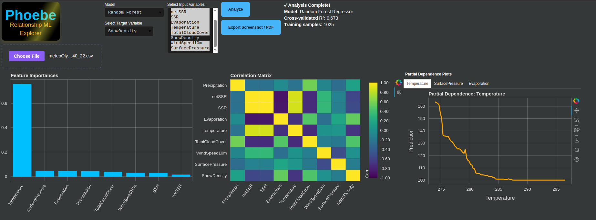

# Phoebe: Relationship Explorer

**Phoebe** is a visual, no-code app for instantly exploring what drives your data.  
Upload any CSV or Excel file, select your target and input variables, and let Phoebe reveal which variables best explain your outcomes using machine learning.

---

## Features

- **Upload Data:** Accepts `.csv`, `.xls`, and `.xlsx` files. See a sample: assets/meteoOlympus_40_22.csv (ERA5 meteorology data somewhere at mount Olympus, Greece)
- **Model Choices:** Random Forest, Logistic Regression, Linear Regression, and XGBoost.
- **Automatic Data Cleaning:** Handles missing and non-numeric data for you.
- **Feature Importance:** Interactive bar chart of most predictive variables.
- **Correlation Heatmap:** Colorful, interactive matrix with hover and colorbar.
- **Partial Dependence Plots:** Visualize how top features influence predictions.
- **Export:** Download a static HTML report or save a dashboard screenshot.

---

## Usage

1. **Install requirements:**
    ```bash
    pip install bokeh pandas scikit-learn numpy openpyxl
    pip install xgboost  # optional, for XGBoost model
    ```

2. **Run the app:**
    ```bash
    bokeh serve phoebe.py --show
    ```

3. **Upload your data file** (CSV or Excel).
4. **Select target and input variables**.
5. **Choose a model** and click **Analyze**.
6. **Explore** feature importance, correlation heatmap, and partial dependence plots.
7. **Export** results as HTML or screenshot.

---

## Why Phoebe?

- Saves hours of exploratory data analysis.
- No programming required—point and click.
- Ideal for researchers, analysts, and anyone wanting quick, visual data insights.

---

## License

MIT License

---

*For questions, suggestions, or issues, open an issue or contact the maintainer.*

